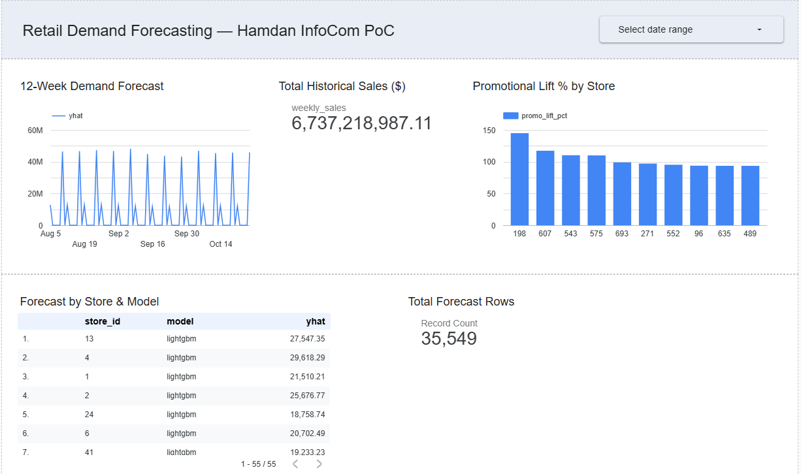

# Retail Demand Forecasting & Inventory Intelligence Pipeline


> An end-to-end ML pipeline proof-of-concept built for **Hamdan InfoCom**, demonstrating feasibility of a production-grade demand forecasting system for retail and SME clients.

> **Note:** This pipeline was scoped and architected during my time at Hamdan InfoCom, Belagavi, as a feasibility prototype for retail clients considering a full demand forecasting system. This repository is a portfolio reconstruction using public benchmark datasets (Walmart, Rossmann, Online Retail II) as proxies for client sales data.

---

## Dashboard Preview



---

## 🚀 Live Demo

The forecasting API is deployed on **Google Cloud Run** (asia-south1).

| Endpoint | URL |
|---|---|
| **Demo UI** | [/ui](https://retail-forecast-api-612014045887.asia-south1.run.app/ui) |
| **API Docs** | [/docs](https://retail-forecast-api-612014045887.asia-south1.run.app/docs) |
| **Health Check** | [/health](https://retail-forecast-api-612014045887.asia-south1.run.app/health) |

**Try it:** Select a store, choose LightGBM or Prophet, and click **Run Forecast** to see 12-week demand predictions with inventory risk tiers.

> Cloud Run URL: `https://retail-forecast-api-612014045887.asia-south1.run.app`  
> GCP Project: `retail-pipeline-poc` · Region: `asia-south1`

---

## Architecture

```
Raw Data (Kaggle/UCI)
        │
        ▼
  Apache Airflow          ← orchestration (Docker, LocalExecutor)
  (3 ingestion DAGs)
        │
        ▼
  Google Cloud Storage    ← immutable raw data lake
  (retail-pipeline-raw/)
        │
        ▼
  BigQuery (retail_raw)   ← untransformed source tables
        │
        ▼
  dbt Core                ← transformation layer
  (staging → marts)
        │
        ▼
  BigQuery (retail_marts) ← business-ready analytics tables
        │
        ▼
  Prophet + LightGBM      ← forecasting models (tracked in MLflow)
        │
        ▼
  mart_demand_forecast    ← forecast output in BigQuery
        │
        ▼
  Looker Studio           ← dashboard for business stakeholders
```

---

## Stack

| Layer | Technology |
|---|---|
| Orchestration | Apache Airflow 2.9.1 (Docker) |
| Data Lake | Google Cloud Storage |
| Data Warehouse | BigQuery |
| Transformation | dbt Core 1.8.3 (BigQuery adapter) |
| Forecasting | Prophet 1.1.5, LightGBM 4.3.0 |
| Experiment Tracking | MLflow 2.14.1 |
| Dashboard | Looker Studio |
| API | FastAPI on Google Cloud Run |
| Version Control | GitHub |
| Language | Python 3.8 |

---

## Datasets

| Dataset | Source | Size | Granularity |
|---|---|---|---|
| Walmart Store Sales | Kaggle | 421k rows | Weekly, 45 stores, 99 depts |
| Rossmann Store Sales | Kaggle | 1M+ rows | Daily, 1,115 stores |
| Online Retail II | UCI ML Repository | 1M+ rows | Transactional |

---

## Project Structure

```
retail-pipeline/
├── api/
│   ├── main.py           ← FastAPI app (Cloud Run)
│   ├── ui.html           ← demo UI
│   └── Dockerfile
├── airflow/
│   └── dags/
│       ├── dag_walmart_ingest.py
│       ├── dag_rossmann_ingest.py
│       └── dag_online_retail_ingest.py
├── dbt/
│   └── retail_forecasting/
│       └── models/
│           ├── staging/
│           │   ├── stg_walmart_sales.sql
│           │   ├── stg_rossmann_sales.sql
│           │   └── stg_online_retail.sql
│           └── marts/
│               ├── mart_weekly_sales.sql
│               ├── mart_store_features.sql
│               ├── mart_promotion_lift.sql
│               ├── mart_inventory_risk.sql
│               └── mart_demand_features.sql
├── ml/
│   ├── train_prophet.py
│   ├── train_lightgbm.py
│   ├── forecast_output.py
│   └── drift_detection.py
├── credentials/          ← gitignored
├── data/                 ← gitignored
├── mlflow/               ← gitignored
├── Dockerfile
├── docker-compose.yml
└── requirements-airflow.txt
```

---

## Pipeline Phases

### Phase 1 — Environment Setup
Docker + Airflow, GCP project, GCS buckets, BigQuery datasets, dbt project, MLflow server.

### Phase 2 — Data Ingestion
Three Airflow DAGs ingesting Walmart, Rossmann, and Online Retail II datasets into BigQuery with schema validation and data quality checks.

### Phase 3 — dbt Transformations
- **Staging**: `stg_walmart_sales`, `stg_rossmann_sales`, `stg_online_retail` — type casting, NA handling, joins
- **Marts**: `mart_weekly_sales`, `mart_store_features`, `mart_promotion_lift`, `mart_inventory_risk`, `mart_demand_features`
- 23/23 dbt tests passing

### Phase 4 — ML Forecasting
| Model | Approach | WMAE |
|---|---|---|
| Prophet | Per-store, multiplicative seasonality | 92,715 |
| LightGBM | Global model, all stores/depts | **1,050** |

LightGBM outperforms Prophet by ~98% due to its ability to learn cross-store patterns and leverage engineered lag features. Top predictive features: `dept_id`, `week_of_year`, `rolling_4wk_avg`, `sales_lag_1wk`, `sales_lag_52wk`.

### Phase 5 — Dashboard & API
Looker Studio dashboard connected to BigQuery showing forecast vs actuals, promotional lift by store, and inventory risk tiers. FastAPI service deployed on Cloud Run exposes forecast endpoints with a self-serve demo UI.

---

## Key Findings

1. **LightGBM global models significantly outperform per-store Prophet models** for this dataset. The cross-store signal (dept_id, seasonality) is more valuable than store-specific trend fitting.

2. **Promotional lift varies significantly by store** — Rossmann data shows some stores achieve 30%+ sales lift during promotions while others show minimal impact, enabling targeted promotion strategy.

3. **~15% of store/dept combinations are HIGH demand risk** (CV > 0.5), meaning inventory planning for these is significantly harder and benefits most from automated forecasting.

4. **Holiday weeks are the primary forecast challenge** — weighted 5x in WMAE metric, they account for disproportionate error in both models.

5. **Drift detection confirms model stability on core demand signals** — PSI analysis of the final 12 weeks vs. the training baseline shows all lag features, rolling averages, weekly sales, and store/dept distributions are LOW drift (PSI < 0.1). Elevated PSI on `week_of_year`, `month`, `quarter`, and markdown flags is expected: the recent window covers only Aug–Oct (weeks 32–43), while the baseline spans the full year, and Walmart's markdown programme was rolled out progressively over 2011–2012. No retraining is indicated.

---

## Business Impact (PoC Framing)

This proof-of-concept demonstrates that a retail client with weekly sales data across multiple stores can:

- **Reduce stockouts** by forecasting demand 12 weeks ahead at store+dept granularity
- **Optimize promotion spend** by identifying which stores have the highest promotional lift
- **Prioritize inventory planning effort** using demand risk tiers (HIGH/MEDIUM/LOW)
- **Run the full pipeline automatically** via Airflow on a weekly schedule

Estimated production build timeline: 8–12 weeks. Infrastructure cost on GCP: ~$200–400/month for a mid-size retailer (50 stores, daily pipeline runs).

---

## Running the Pipeline

### Prerequisites
- Docker Desktop
- Python 3.8+
- GCP account with billing enabled
- Kaggle account

### Setup
```bash
# 1. Clone the repo
git clone https://github.com/ShridharPol/retail-demand-forecasting.git
cd retail-demand-forecasting

# 2. Create venv and install dependencies
python -m venv .venv
.venv\Scripts\Activate.ps1        # Windows
pip install dbt-core==1.8.3 dbt-bigquery==1.8.2
pip install mlflow==2.14.1 prophet==1.1.5 lightgbm==4.3.0 scikit-learn==1.3.2

# 3. Set up GCP (edit infra/gcp_setup.sh with your project ID)
# Run GCP bootstrap, place service account key in credentials/

# 4. Configure dbt
# Edit ~/.dbt/profiles.yml with your project and keyfile path

# 5. Start Airflow
docker compose up --build -d

# 6. Trigger ingestion DAGs at http://localhost:8080

# 7. Run dbt
cd dbt/retail_forecasting
dbt run
dbt test

# 8. Train models
cd ../..
python ml/train_prophet.py
python ml/train_lightgbm.py
python ml/forecast_output.py
```

---

## Why Not DVC?

GCS + MLflow + dbt already provide full data and model lineage:
- **GCS** versions raw data by bucket path and ingestion timestamp
- **dbt** versions all transformations via Git
- **MLflow** tracks every experiment, parameter, metric, and model artifact

DVC would add a third versioning layer with no additional capability for this stack.

---

*Built by Shridhar Sunilkumar Pol as a portfolio project for Hamdan InfoCom, Belagavi, India.*